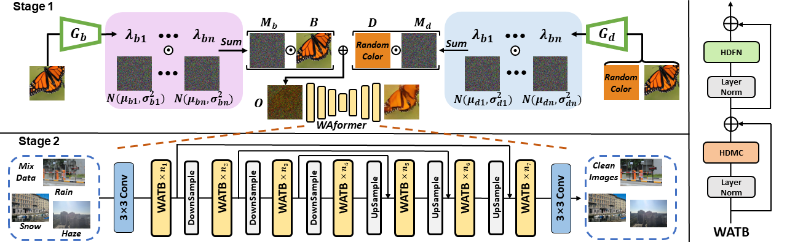
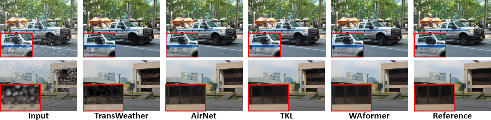

# Dynamic Adaptive Network and Weather-Agnostic Pre-Training for Multiple Adverse Weather Removal (in submission)


> **Abstract:** *Removing multiple adverse weather with a single-trained model has recently attracted considerable attention. However, existing methods strive to handle different weather with distinctive peculiarity and appearance through frozen filters, which may fail to capture exclusive features for specific degraded images. Besides, explicit multi-weather intrinsic prior learning has remained unexplored, leading to inadequate weather modeling and representation. In this paper, we attempt to ameliorate these issues from the perspective of network adaptiveness and prior mining. Specifically, to more flexibly and adaptively tackle diverse weather patterns, we propose a novel weather adaptive Transformer (WAformer) that can handle varying weather degradations with dynamic kernel weights. Considering the communal features (e.g., background representation) among different weather, WAformer predicts only half of the filters for distinguishing features characterization while the other static half is utilized for general features extraction. In addition, we define a new unified formulation for multiple weather and based on this, present a simple but effective self-supervised pre-training strategy, namely blind background decomposition (BBD). Such strategy can drive generic prior learning of background recovering from superimposed observations to boost unified multiple weather representation in the formal stage. Extensive experimental results demonstrate that our WAformer performs favorably against state-of-the-art algorithms and the BBD can assist in learning weather-agnostic decomposition prior.* 

## Framework Architecture
<table>
  <tr>
    <td>  </td>
  </tr>
  <tr>
    <td><p align="center"><b>Overall Framework of Our Proposed Method</b></p></td>
  </tr>
</table>


## Installation
The model is built in PyTorch 1.1.0 and tested on Ubuntu 16.04 environment (Python3.7, CUDA9.0, cuDNN7.5).

For installing, follow these intructions
```
conda create -n pytorch1 python=3.7
conda activate pytorch1
conda install pytorch=1.1 torchvision=0.3 cudatoolkit=9.0 -c pytorch
pip install matplotlib scikit-image opencv-python timm einops ptflops PIL argparse
```

## Pre-training
- Download the [ImageNet](dataset/README.md) and run

```
cd dataset
python prepare_imagenet.py
```
-  Pre-train the model with default arguments by running

```
python pre-training.py
```

## Training
- Download the [dataset](dataset/README.md) and run

```
cd dataset
python prepare.py
```
-  Train the model with default arguments by running

```
python train.py
```


## Evaluation

1. Download the pre-trained model and place it in `./checkpoints/`

2. Download the dataset and place it in `./datasets/`

3. Run
```
python test.py
```
4. Visual results wii be saved in results

## Visual Results
<table>
  <tr>
    <td>  </td>
  </tr>
</table>


