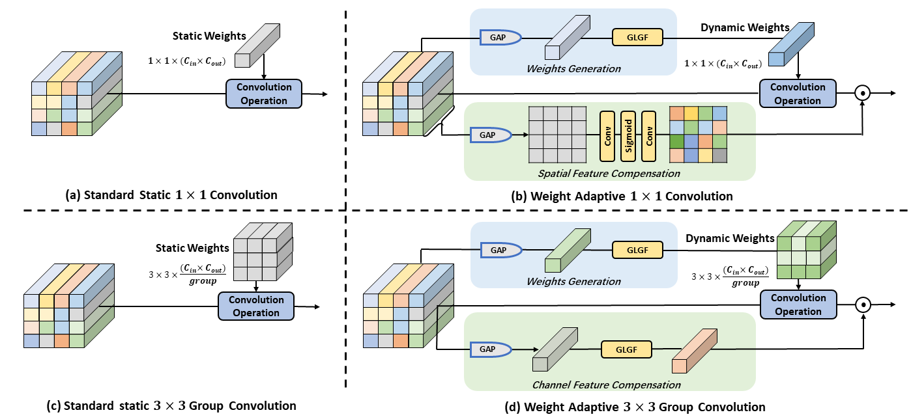

# Mining Instance-Exclusive Features for All-In-One Adverse Weather Removal via Dynamically Generated Weights (in submission)


> **Abstract:** *Images captured under different weather conditions exhibit different degradation characteristics and patterns. However, existing all-in-one adverse weather removal methods aim to learn shared generic knowledge of multiple weather conditions via fixed network parameters, which fails to adjust for different instances to fit exclusive features characterization of specific weather conditions. To tackle this issue, we propose a novel dynamic weights generation network (DwGN) that can adaptively mine the instance-exclusive degradation features for different weather conditions via dynamically generated convolutional weights. Specifically, we first propose two fundamental dynamic weights convolutions, which can automatically generate optimal convolutional weights for distinct pending features via a lightweight yet efficient mapping layer. The predicted convolutional weights are then incorporated into the convolution operation to mine instance-exclusive features for different weather conditions. Building upon the dynamic weights convolutions, we further devise two core modules for network construction: half-dynamic multi-head cross-attention (HDMC) that performs exclusive-generic feature interaction, and half-dynamic feed-forward network (HDFN) that performs selected exclusive-generic feature transformation and aggregation. Considering communal feature representations shared between different weather conditions (e.g., background representation), both HDMC and HDFN strategically deploy only half of the dynamic weights convolutions for instance-exclusive feature mining while still deploying half of the static convolutions to mine generic features. Through adaptive weight tuning, our DwGN can adaptively adapt to different weather scenarios and effectively mine the instance-exclusive degradation features, thus enjoying better flexibility and adaptability under all-in-one adverse weather removal. Extensive experimental results demonstrate that our DwGN performs favorably against state-of-the-art algorithms.* 

## Framework Architecture
<table>
  <tr>
    <td>  </td>
  </tr>
  <tr>
    <td><p align="center"><b>Overall Framework of Our Proposed Method</b></p></td>
  </tr>
</table>


## Installation
The model is built in PyTorch 1.1.0 and tested on Ubuntu 16.04 environment (Python3.7, CUDA9.0, cuDNN7.5).

For installing, follow these intructions
```
conda create -n pytorch1 python=3.7
conda activate pytorch1
conda install pytorch=1.1 torchvision=0.3 cudatoolkit=9.0 -c pytorch
pip install matplotlib scikit-image opencv-python timm einops ptflops PIL argparse
```

## Pre-training
- Download the [ImageNet](dataset/README.md) and run

```
cd dataset
python prepare_imagenet.py
```
-  Pre-train the model with default arguments by running

```
python pre-training.py
```

## Training
- Download the [dataset](dataset/README.md) and run

```
cd dataset
python prepare.py
```
-  Train the model with default arguments by running

```
python train.py
```


## Evaluation

1. Download the pre-trained model and place it in `./checkpoints/`

2. Download the dataset and place it in `./datasets/`

3. Run
```
python test.py
```
4. Visual results wii be saved in results

## Visual Results
<table>
  <tr>
    <td>  </td>
  </tr>
</table>


